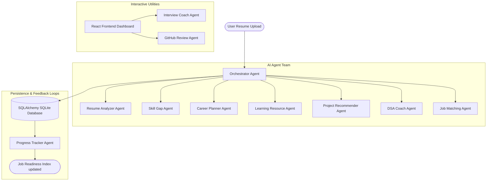

# CareerPilot AI – Multi-Agent Career Copilot

CareerPilot AI is a production-quality, multi-agent career mentoring web application designed to guide students and professionals. Powered by a collaborative team of **10 specialized AI agents** orchestrated by a central dispatcher, it analyzes resumes, matches skills against target roles, maps out custom learning timelines, hosts interactive mock technical interviews, generates daily algorithmic DSA schedules, reviews GitHub portfolios, and updates a centralized Job Readiness Index (JRI).

This project is built for the **Kaggle AI Agents Intensive Capstone**, showcasing how independent, specialized agents collaborate on a unified career command dashboard instead of running as a single generic chatbot.

---

## 🏗️ Multi-Agent Architecture & Data Flow

CareerPilot AI separates business logic and reasoning requirements across independent agent modules. They exchange data inside a structured pipeline orchestrated by the `OrchestratorAgent`.



### Specialized Agents & Roles
1. **Orchestrator Agent**: Manages the transactional logic, coordinating execution sequences, and handling fallbacks.
2. **Resume Analyzer Agent**: Parses resumes, checks section compliance, scores ATS formatting (0-100), and flags strengths/weaknesses.
3. **Skill Gap Agent**: Cross-references resume details against standard role requirements to identify missing capabilities.
4. **Career Planner Agent**: Formulates a personalized chronological milestone timeline (30/90 days tasks).
5. **Learning Resource Agent**: Discovers high-quality non-duplicate reference courses across YouTube, Kaggle, and documentation.
6. **Project Recommender Agent**: Recommends hands-on portfolio projects complete with difficulty levels and visual folder structures.
7. **DSA Coach Agent**: Generates a 5-day algorithmic practice path complete with Easy-to-Hard checkboxes.
8. **Job Matching Agent**: Maps skillset compatibility percentages across standard tech roles (ML, DevOps, Backend).
9. **GitHub Review Agent**: Audits repository structures, document styles, and commit messages to rate portfolio readiness.
10. **Progress Tracker Agent**: Updates streaks and aggregates subscores to calculate the global Job Readiness Index (JRI).

---

## 🛠️ Technology Stack

### Frontend
- **React (v19) & TypeScript**: Strict typing and component boundaries.
- **Tailwind CSS (v4)**: Modern variables configurations, glassmorphic filters, and premium styling.
- **Framer Motion**: Smooth entry sweeps, tab transitions, and pulsing indicator loops.
- **Recharts**: Beautiful area metrics visualizing JRI timeline progress.
- **React Router (v7)**: Routing structure utilizing `HashRouter` for zero-config build previews.

### Backend
- **FastAPI**: Concurrent asynchronous ASGI request handling.
- **Google GenAI SDK (Gemini)**: Structured JSON schemas output generation.
- **SQLAlchemy & SQLite**: Self-contained single-file relational database.
- **Bcrypt**: Native cryptography password hashing.

---

## ⚙️ Environment Variables & Setup

### Environment Settings (`backend/.env`)
Create a `.env` file in the `backend/` directory:
```env
PORT=8000
HOST=0.0.0.0
DATABASE_URL=sqlite:///./careerpilot.db
SECRET_KEY=supersecretjwtkeyforcareerpilotai123456!@#
ALGORITHM=HS256
ACCESS_TOKEN_EXPIRE_MINUTES=1440

# Google AI Studio Gemini API Key
GEMINI_API_KEY=your_gemini_api_key_here
```
> [!NOTE]
> If no `GEMINI_API_KEY` is provided, CareerPilot AI will automatically default to **Demo Mode**, seeding rich realistic mock data so judges can evaluate all 10 agents without setting up keys.

---

## 🚀 Installation & Running Locally

### Step 1: Clone and setup the Backend
1. Open a terminal in `backend/`:
   ```bash
   cd backend
   pip install -r requirements.txt
   ```
2. Start the FastAPI server:
   ```bash
   uvicorn app.main:app --reload --port 8000
   ```
3. The server will run at `http://localhost:8000` with interactive docs at `/docs`.

### Step 2: Setup the Frontend
1. Open another terminal in `frontend/`:
   ```bash
   cd frontend
   npm install --legacy-peer-deps
   ```
2. Start the Vite development server:
   ```bash
   npm run dev
   ```
3. Open `http://localhost:5173` in your browser.

---

## ⚡ Video Demo & Judge Review Mode
To explore the application instantly:
1. Open the login page.
2. Click the **⚡ Load Judge Demo Mode** button.
3. The application will log you in and auto-seed the SQLite database with a rich profile containing mock roadmaps, interview records, DSA progress, and GitHub analyses. Every widget will instantly display visual statistics.

---

## 📄 License
This project is licensed under the MIT License.
